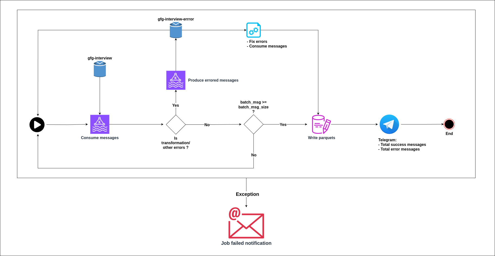
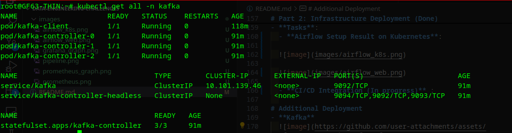
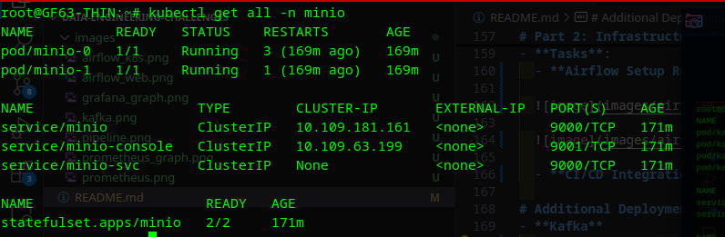

# Data Engineering Challenges

---

## Table of Contents

- [Assignment Overview](#assignment-overview)
  - [Scenario A: Input from Kafka, Output to Amazon S3](#scenario-a-input-from-kafka-output-to-amazon-s3)
  - [Scenario B: Input from BigQuery (BQ), Output to Amazon S3](#scenario-b-input-from-bigquery-bq-output-to-amazon-s3)
- [Part 1: Data Pipeline Implementation](#part-1-data-pipeline-implementation)
  - [Data Description](#data-description)
    - [Data Fields](#data-fields)
    - [Sample Data](#sample-data)
    - [Data Processing](#data-processing)
      - [Example of Transformed Data](#example-of-transformed-data)
  - [Optional Step: Monitoring and Alerting](#optional-step-monitoring-and-alerting)
- [Part 2: Infrastructure Deployment](#part-2-infrastructure-deployment)
- [Deliverables](#deliverables)
- [How to Submit the Assignment](#how-to-submit-the-assignment)
- [Additional Guidelines](#additional-guidelines)
- [Evaluation Criteria](#evaluation-criteria)

---

# Assignment Overview

## Scenario A: Input from Kafka, Output to Amazon S3 [Selected]

- **Input Source**: Apache Kafka
- **Output Destination**: Amazon S3
- **Daily Data Volume**: Approximately 400-500 GiB
- **Task**: Ingest low-latency streaming data from Kafka, process it, and store the transformed data in Amazon S3.
- **Pipeline**



---

# Part 1: Data Pipeline Implementation (Done)

## Data Description

- **Data Type**: User action events.

### Data Fields

- **timestamp**: The time at which the event occurred.
- **event_name**: The type of the event (e.g., click, view, purchase).
- **user_identifiers**:
  - **platform**: The platform used by the user (e.g., web, mobile).
  - **id**: Unique identifier for the user.
- **product_information**:
  - **name**: Name of the product involved in the event.
  - **SKU**: Stock Keeping Unit identifier of the product.

### Sample Data

```json
{
  "timestamp": "2023-10-23T12:34:56Z",
  "event_name": "view",
  "user_identifiers": {
    "platform": "web",
    "id": "user_12345"
  },
  "product_information": {
    "name": "Wireless Mouse",
    "SKU": "SKU-1001"
  }
}
```

```json
{
  "timestamp": "2023-10-23T12:35:10Z",
  "event_name": "click",
  "user_identifiers": {
    "platform": "mobile",
    "id": "user_67890"
  },
  "product_information": {
    "name": "Bluetooth Headphones",
    "SKU": "SKU-2002"
  }
}
```

```json
{
  "timestamp": "2023-10-23T12:36:05Z",
  "event_name": "purchase",
  "user_identifiers": {
    "platform": "web",
    "id": "user_12345"
  },
  "product_information": {
    "name": "Mechanical Keyboard",
    "SKU": "SKU-3003"
  }
}
```

### Data Processing

- **Transformation Requirements**:
  - **Parsing and Validation**: Each record ensure that contain all fields and has data types as below
  ```
  schema = {
    "event_datetime": Datetime,
    "event_date": Date,
    "event_name": String,
    "user_id": String,
    "platform": String,
    "product_name": String,
    "SKU": String,
  }
  ``` 
  - **Data Enrichment** (Optional): **event_date** added more after transforming 
  - **Handling Missing or Null Values**: Fields don't exist that is null/None
- **Output Format**:
  - Data is stored in Amazon S3 in a partitioned parquet format (partitioned event_date).

#### Example of Transformed Data

```json
{
  "event_datetime": "2023-10-23T12:34:56Z",
  "event_date": "2023-10-23",
  "event_name": "view",
  "user_id": "user_12345",
  "platform": "web",
  "product_name": "Wireless Mouse",
  "SKU": "SKU-1001"
}
```

## Optional Step: Monitoring and Alerting (Done)

- **Tools and Mechanisms**: 
  - **Monitoring**: 

    Prometheus 

    

    
    
    Grafana

    


  - **Alerting**: 
    - Telegram notifications with success/error count
    
    
---

# Part 2: Infrastructure Deployment (Done)

- **Tasks**:

  **Airflow Setup Result on Kubernetes**: 

  

  

  
  
  **CI/CD Integration**:

  

  
# Additional Deployment
- **Kafka**
  

- **Minio**

  Emulate for AWS S3 storage

  

  Result after storing partitioned parquet

  

  

---
